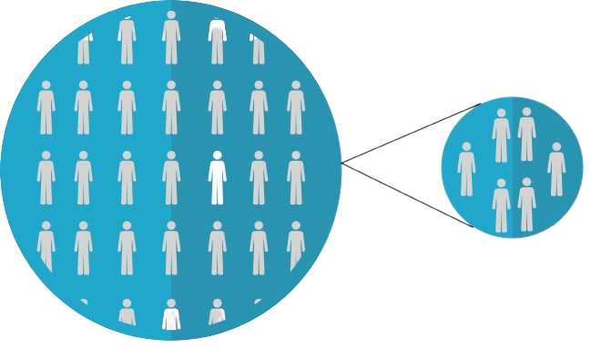
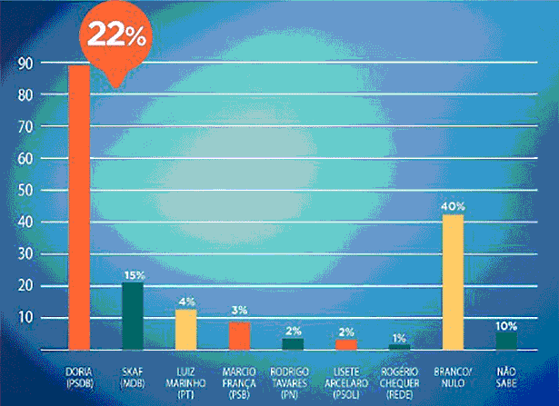
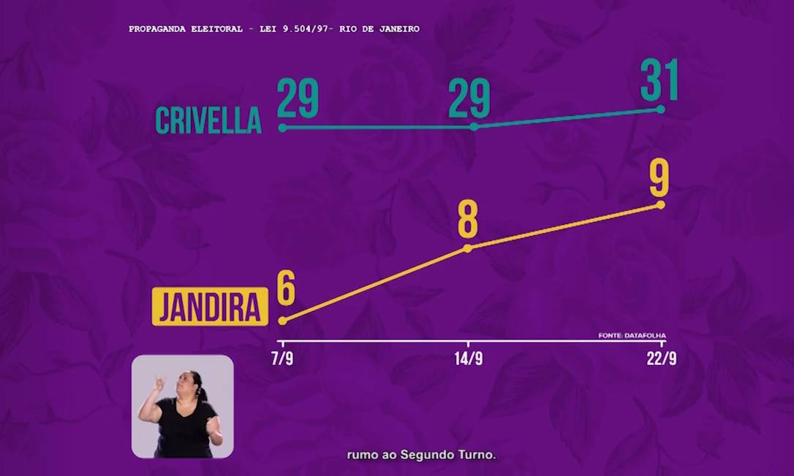
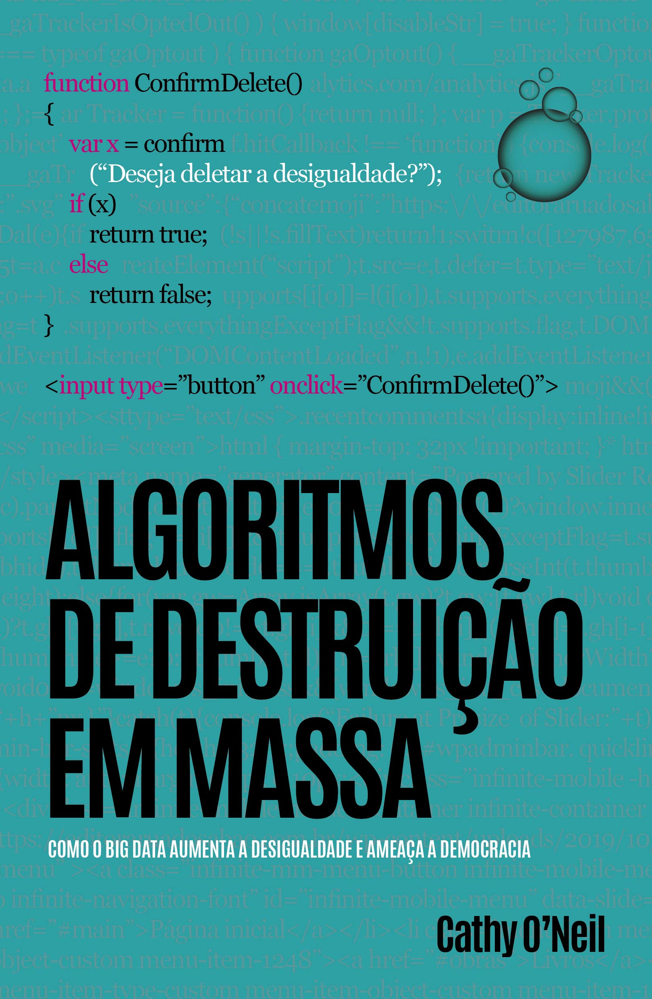

```{r, include = FALSE}
source("./config/setup.R")
```

## Estatística

::: {.block}
### 
Conjunto de métodos e técnicas usados para organizar, descrever, analisar e interpretar dados.
:::


 - Compreende:
   1. Planejamento (delineamento) de estudos e coleta de dados (amostragem).
   2. Descrição, análise e interpretação dos dados.

 - Permite:
   1. Extrair informações importantes para tomada de decisões.
   2. Avaliar evidências empíricas sob hipóteses de interesse.
 
## Conceitos fundamentais

 - **População**: conjunto de seres, itens ou eventos com uma característica comum. 
   - TODOS aqueles que possuem a característica de interesse pertencem à população.
 - **Amostra**: subconjunto da população.
 - **Variáveis**: características observadas em cada elemento.

Em Estatística tentamos entender o que acontece na população com base no que observamos em uma amostra. 

## População x Amostra

\beginAHalfColumn

 - O objetivo de qualquer estudo é avaliar a \textbf{população}. 

 - Nem sempre é possível coletar dados de toda a população.
 
 - A alternativa é trabalhar com uma \textbf{amostra}.
 
 - Caso toda a população seja acessível no estudo, fazemos um estudo censitário (\textbf{censo}).

\endColumns
\beginAHalfColumn

```{r, echo = FALSE, out.width='100%', fig.align='center', fig.cap="Representação população/amostra. Extraído de \\href{https://cdn.pixabay.com/photo/2017/10/25/18/18/rare-disease-2888820_1280.png}{pixabay.com.}"}


```

\endColumns

## Exemplos

 - Existe interesse em avaliar a opinião dos \textbf{alunos da UFPR} a respeito de determinada política.
    - \textbf{População}: todos os alunos da UFPR.
    - \textbf{Amostra}: parte dos alunos da UFPR.
    
 - Um pesquisador propôs uma nova droga que tem como objetivo reduzir \textbf{cólicas menstruais}.
    - \textbf{População}: todas as mulheres que apresentam cólicas menstruais.
    - \textbf{Amostra}: parte da população de mulheres que apresentam cólicas.

## Etapas da análise estatística

De forma geral, as etapas para análise de um conjunto de dados são:

1. Definição do problema (objetivos, população e variáveis de interesse).
2. Planejamento do estudo.
3. Coleta, limpeza e validação de dados.
4. Análise dos dados
   - Análise exploratória.
   - Aplicação de métodos mais sofisticados que permitam generalizar os resultados para a população.
5. Interpretação dos resultados.

## Alguns exemplos de aplicações de Estatística 

\beginAHalfColumn

 - \textbf{Medicina}: eficácia de tratamentos propostos.

 - \textbf{Indústria}: avaliação de qualidade de itens produzidos.
 
 - \textbf{Negócios}: análise do perfil dos indíviduos para concessão de crédito.

\endColumns
\beginAHalfColumn

```{r, echo = FALSE, out.width='15%', fig.align='center', fig.cap="Extraído de \\href{https://cdn.pixabay.com/photo/2018/04/06/19/39/symbol-3296654_1280.png}{pixabay.com.}"}

```

```{r, echo = FALSE, out.width='15%', fig.align='center', fig.cap="Extraído de \\href{https://cdn.pixabay.com/photo/2012/04/26/18/16/factory-42708_1280.png}{pixabay.com.}"}

```

```{r, echo = FALSE, out.width='15%', fig.align='center', fig.cap="Extraído de \\href{https://pixabay.com/pt/vectors/dinheiro-saco-saco-de-dinheiro-1910761/}{pixabay.com.}"}

```

\endColumns

## Temas da Estatística

1. \textbf{Estatística descritiva ou exploratória.}
    - Coleta, organização, tratamento, análise e apresentação de dados.

2. \textbf{Probabilidade.}
    - Modelagem de fenômenos aleatórios para estudar a chance de ocorrência de desfechos.

3. \textbf{Inferência estatística.}
    - Estudo da população por meio de evidência fornecida pela amostra.


## Temas da Estatística

\beginAHalfColumn

1. \textbf{Estatística descritiva ou exploratória.}
    - Métodos de amostragem.
    - Representação tabular.
    - Análise gráfica.
    - Medidas resumo.

2. \textbf{Probabilidade.}
    - Teoria das probabilidades.
    - Variáveis aleatórias.
    - Distribuições de probabilidade.

\endColumns
\beginAHalfColumn

3. \textbf{Inferência estatística.}
    - Estimação pontual.
    - Estimação intervalar.
    - Testes de hipóteses

\endColumns

## Resultados de uma análise estatística

\beginAHalfColumn

 - O que os dados mostram?
 - A pergunta de pesquisa foi respondida?
 - Existe evidência suficiente nos dados a favor da hipótese inicial?
 - Que novas perguntas surgem?

\endColumns
\beginAHalfColumn

```{r, echo = FALSE, out.width='35%', fig.align='center', fig.cap="Extraído de \\href{https://pixabay.com/pt/vectors/lupa-procurar-ampliar-encontrar-155170/}{pixabay.com.}"}

```

\endColumns

## Estatística e ética


\beginAHalfColumn

 - Cuidados devem ser tomados na escolha do tipo análise a ser realizada.

 - O uso e divulgação \textbf{ética e criteriosa} de dados e resultados de análises devem ser pré-requisitos indispensáveis e inegociáveis à qualquer analista. 

 - Por exemplo, no contexto de gráficos, devemos evitar que o gráfico fique desproporcional ou privilegiando determinados valores a fim de induzir conclusões àqueles que utilizam o gráfico como forma de visualização.

\endColumns
\beginAHalfColumn

```{r, echo = FALSE, out.width='75%', fig.align='center', fig.cap="Extraído de \\href{https://cdn.pixabay.com/photo/2021/11/13/18/48/devil-6792088_1280.png}{pixabay.com.}"}

```

\endColumns

## Estatística e ética

```{r, echo = FALSE, out.width='100%', fig.align='center', fig.cap="Exemplo de gráfico desproporcional. Extraído de \\href{https://noticias.uol.com.br/politica/eleicoes/2018/noticias/2018/05/30/psdb-sp-divulga-grafico-desproporcional-de-doria-e-tira-do-ar-apos-criticas.htm}{Uol Notícias.}"}


```

## Estatística e ética

```{r, echo = FALSE, out.width='70%', fig.align='center', fig.cap="Exemplo de gráfico desproporcional. Extraído de \\href{https://oglobo.globo.com/politica/no-rio-candidatos-recorrem-pedalada-grafica-para-maquiar-desempenho-20198224}{O Globo.}"}


```


## Estatística e o desenvolvimento científico

 - A Estatística está diretamente associada com o \textbf{método científico}.
   - Definimos uma \textbf{hipótese}.
   - Confrontamos esta hipótese com \textbf{evidências} (dados).
   - Com base nas evidências \textbf{rejeitamos} ou \textbf{não rejeitamos} as hipóteses iniciais.
   - Os resultados conduzem a novas hipóteses e o ciclo se reinicia.
  
 - Praticamente todas as áreas do conhecimento humano requerem instrumentos para \textbf{análise de dados}.
 
 - Muitas áreas do conhecimento requerem \textbf{métodos estatísticos} para avaliar hipóteses de interesse.

## A importância de resultados não significativos

\beginAHalfColumn
 - Muitos pesquisadores deixam de tornar públicos resultados não significativos.
 
 - Contudo resultados não significativos são tão importantes quanto os significativos.
 
 - A hipótese de interesse, rejeitada ou não rejeitada, fornece conhecimento a respeito do problema sob análise.

\endColumns
\beginAHalfColumn 

```{r, echo = FALSE, out.width='40%', fig.align='center', fig.cap="Extraído de \\href{https://cdn.pixabay.com/photo/2021/11/04/14/36/doubt-6768418_1280.png}{pixabay.com.}"}

```

\endColumns

## Estatística e o desenvolvimento computacional

\beginAHalfColumn

 - A popularização da Estatística se dá graças ao \textbf{desenvolvimento computacional}.

 - Os computadores pessoais tornaram os métodos estatísticos mais acessíveis ao público geral por meio de \textbf{softwares} que implementam as metodologias.

 - Devido ao avanço computacional, houve um aumento considerável na capacidade de produzir e armazenar dados provenientes das mais diversas fontes.

\endColumns
\beginAHalfColumn

```{r, echo = FALSE, out.width='60%', fig.align='center', fig.cap="Extraído de \\href{https://cdn.pixabay.com/photo/2020/04/04/04/23/graph-5000784_1280.png}{pixabay.com.}"}


```

\endColumns

## Estatística e o desenvolvimento computacional

\beginAHalfColumn
 - Graças ao avanço computacional podemos lidar com a manipulação de \textbf{grandes conjuntos de dados}.

 - Este grande volume de dados também força o desenvolvimento dos métodos estatísticos e softwares para análise de dados.

 - A capacidade computacional atual também desperta o interesse por métodos estatísticos computacionalmente intensivos.

\endColumns
\beginAHalfColumn

```{r, echo = FALSE, out.width='60%', fig.align='center', fig.cap="Extraído de \\href{https://cdn.pixabay.com/photo/2015/04/14/23/17/it-business-722950_1280.png}{pixabay.com.}"}


```

\endColumns
 
## Considerações finais

 - Onde há \textbf{incerteza}, a Estatística pode ser usada.

 - A Estatística vai muito além do senso comum: tabelas e gráficos em revistas esportivas e jornais ou pesquisas de intenção de voto em épocas de eleição.

 - A Estatística está por trás de boa parte do \textbf{desenvolvimento científico} moderno.

 - Atualmente recursos computacionais são indispensáveis para trabalhar com métodos estatísticos.
 
 - O foco desta disciplina está no \textbf{letramento estatístico}, isto é, apresentar o básico de Estatística que permita \textbf{compreender e avaliar criticamente análises de dados}.
 
## Algumas leituras recomendadas

\beginAHalfColumn

```{r, echo = FALSE, out.width='50%', fig.align='center', fig.cap="Uma senhora toma chá."}


```

\endColumns
\beginAHalfColumn

```{r, echo = FALSE, out.width='50%', fig.align='center', fig.cap="O andar do bêbado."}


```

\endColumns


## Algumas leituras recomendadas

\beginAHalfColumn

```{r, echo = FALSE, out.width='50%', fig.align='center', fig.cap="Como mentir com Estatística."}

knitr::include_graphics("./img/mentir.jpg")
```

\endColumns
\beginAHalfColumn

```{r, echo = FALSE, out.width='50%', fig.align='center', fig.cap="Algoritmos de destruição em massa."}


```

\endColumns

## 

\beginAHalfColumn

\textbf{O que foi visto:}

 - O que é Estatística.
 - Conceitos fundamentais.
 - Etapas do trabalho estatístico.
 - Temas da Estatística.
 - Estatística e ética.
 - Estatística e o desenvolvimento científico.
 - Estatística e o desenvolvimento computacional.

\endColumns
\beginAHalfColumn

\textbf{Próximos assuntos:}

 - Dados.
 - O que são dados.
 - Conjunto de dados.
 - Tipos de variáveis.
 - Fontes de dados.
 - Estudos observacionais e experimentais.

\endColumns
