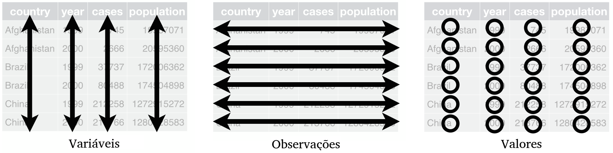
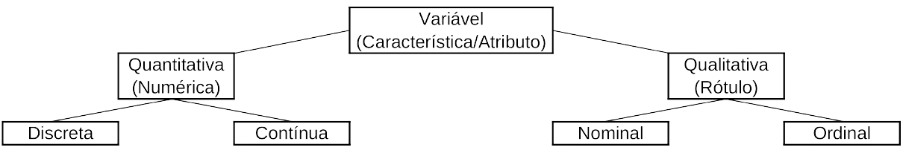

```{r, include = FALSE}
source("./config/setup.R")
```

## O que são dados?

\beginAHalfColumn

 - Dados são \textbf{conjuntos de valores}.
 - Podem ser de diferentes fontes, tais como \textbf{estudos} e \textbf{experimentos}.
 - Podem conter variáveis de diferentes tipos.
 - Podem surgir em formatos \textbf{estruturados} e \textbf{não estruturados}.

\endColumns
\beginAHalfColumn

```{r, echo = FALSE, out.width='90%', fig.align='center', fig.cap="Extraído de \\href{https://cdn.pixabay.com/photo/2018/01/26/18/21/matrix-3109378_1280.jpg}{pixabay.com.}"}

knitr::include_graphics("./img/dados.jpg")
```

\endColumns

## Conjunto de dados

 - Em Estatística, em geral, lidamos com \textbf{dados estruturados em um formato tabular}.

 - O conjunto de dados completo e sem tratamentos é denominado conjunto de \textbf{dados brutos}.
 
 - Um conjunto de dados considerado \textbf{arrumado} é aquele em que: 
   - Cada \textbf{coluna} representa uma \textbf{variável}.
   - Cada \textbf{linha} representa uma \textbf{observação}.
   - Cada \textbf{célula} representa o \textbf{valor} observado.

## Conjunto de dados

```{r, echo = FALSE, out.width='90%', fig.align='center', fig.cap="Extraído de \\href{https://r4ds.had.co.nz/tidy-data.html}{https://r4ds.had.co.nz}."}


```

## Conjunto de dados

```{r, echo=FALSE}
knitr::kable(iris[1:5,], caption = "Exemplo de conjunto de dados")

```

## Tipos de variáveis

 - Na prática, podemos coletar variáveis de diferentes tipos e naturezas.
 
 - Existem dois tipos (básicos) de variáveis:
   - Numéricas (\textbf{quantitativas}).
   - Não numéricas (\textbf{qualitativas}).

 - Cada uma das classes tem suas ramificações.

```{r, echo = FALSE, out.width='90%', fig.align='center', fig.cap="Tipos básicos de variáveis."}


```

## Variáveis quantitativas

\beginAHalfColumn

 - \textbf{Variáveis Quantitativas}: assumem valores numéricos.
   - \textbf{Discretas}: características mensuráveis que podem assumir apenas um número finito ou infinito \textbf{contável} de valores.
   - \textbf{Contínuas}: características mensuráveis que assumem valores em uma \textbf{escala contínua}, isto é, na reta real.

\endColumns
\beginAHalfColumn

\textbf{Exemplos}

 - Altura.
 - Peso.
 - Idade.
 - Percentual de gordura corporal.
 - Número de filhos.
 - Número de fraturas.
 - Número de faltas.
 - Número de peças defeituosas em um lote.
 
\endColumns

## Variáveis qualitativas

\beginAHalfColumn

 - \textbf{Variáveis Qualitativas}: são as características definidas por categorias, ou seja, representam uma classificação dos indivíduos e não uma característica numérica.
   - \textbf{Nominais}: não existe ordenação nem peso entre as categorias.
   - \textbf{Ordinais}: existe uma ordenação entre as categorias.

\endColumns
\beginAHalfColumn

\textbf{Exemplos}
 
 - Estado civil.
 - Orientação sexual.
 - Turma.
 - Posição em que joga em um time.
 - Severidade de uma lesão.
 - Escolaridade.
 - Grau de proficiência em língua inglesa.
 - Risco de infarto.

\endColumns

## Cuidados com variáveis

 - Existem particularidades na classificação de variáveis devido a situações como: 
   - Discretização de variáveis contínuas.
   - Limitações em instrumentos de mensuração.
   - Utilização de quantidades numéricas para representação de variáveis categóricas
   - Dentre outras.
 
 - Deve-se sempre estar atento a este tipo de situação pois podem levar a implicações nas análises e consequentemente nos resultados.

 - Existem outros tipos de variáveis que ocorrem em situações particulares que requerem técnicas específicas de análise.
 
## De onde vêm os dados?


\beginAHalfColumn

\textbf{Alguns exemplos}:

 - Estudos de caso.
 - Experimentos.
 - Pesquisas.
 - Registros administrativos.
 - Dados em repositórios online.
 - Bancos de dados corporativos.

\endColumns
\beginAHalfColumn

```{r, echo = FALSE, out.width='90%', fig.align='center', fig.cap="Extraído de \\href{https://cdn.pixabay.com/photo/2022/03/02/09/37/data-7042739_1280.png}{pixabay.com.}"}


```

\endColumns

## Dados observacionais x dados experimentais

\beginAHalfColumn

\textbf{Dados observacionais}

 - \textbf{Observação passiva} da realidade. 
 - Sem modificação das condições.

\textbf{Dados experimentais}

 - \textbf{Intervenção} na realidade.
 - Condições controladas.
 - Observação dos efeitos das intervenções.
 
\endColumns
\beginAHalfColumn

```{r, echo = FALSE, out.width='90%', fig.align='center', fig.cap="Extraído de \\href{https://cdn.pixabay.com/photo/2013/07/12/15/08/earth-149499_1280.png}{pixabay.com.}"}


```

\endColumns

## No que devemos pensar antes de analisar nossos dados?

 - O que estamos interessados em avaliar?
 - Quais são as variáveis de interesse?
 - Quais são as variáveis que queremos avaliar se influenciam a variável de interesse?
 - Quais são os métodos disponíveis para análise de variáveis deste tipo?
 - Quais os métodos disponíveis que permitem responder nossa pergunta de pesquisa?
 - Como coletar os dados?
 - Os dados são válidos?

## 

\beginAHalfColumn

\textbf{O que foi visto:}

 - Dados.
 - O que são dados.
 - Conjunto de dados.
 - Tipos de variáveis.
 - Fontes de dados.
 - Estudos observacionais e experimentais.

\endColumns
\beginAHalfColumn

\textbf{Próximos assuntos:}

 - Amostras.
 - Métodos de amostragem.
 - Amostragem probabilística.
 - Amostragem não probabilística.

\endColumns

