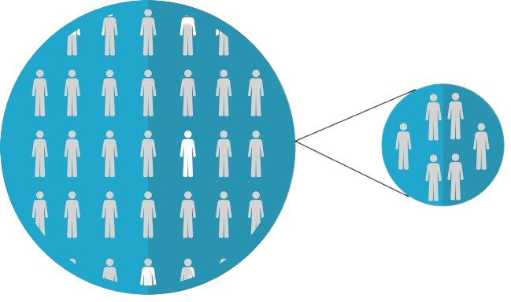

```{r, include = FALSE}
source("./config/setup.R")
```

## Amostras


\beginAHalfColumn

 - Uma amostra é um \textbf{subconjunto da população}. 
  
 - Na prática é inviável trabalhar com a população toda. 
 
 - A alternativa então é trabalhar com uma amostra e \textbf{inferir} os resultados para a população. 
 
 - A seleção da amostra pode ser feita de diversas maneiras. 

\endColumns
\beginAHalfColumn

```{r, echo = FALSE, out.width='100%', fig.align='center', fig.cap="Extraído de \\href{https://cdn.pixabay.com/photo/2017/10/25/18/18/rare-disease-2888820_1280.png}{pixabay.com.}"}


```

\endColumns


## Amostras
 
\beginAHalfColumn 

 - Os métodos de amostragem servem para selecionar subconjuntos da população de forma mais \textbf{representativa} possível.

 - A forma adequada de amostragem conduz a um \textbf{menor tamanho amostral} para obtenção de uma \textbf{precisão satisfatória}.

\endColumns
\beginAHalfColumn

 - São características desejáveis de uma amostra:
   - Capacidade de generalização.
   - Imparcialidade e representatividade.
   - Capacidade de medir a precisão das estimativas.

 - Podemos dividir os métodos em: 
   - Amostragem probabilística.
   - Amostragem não probabilística.

\endColumns

# Amostragem probabilística

## Amostragem probabilística


\beginAHalfColumn

 - Amostragem probabilística deve ser usada \textbf{sempre que possível}.

 - O objetivo é dimensionar amostras que sejam capazes de \textbf{estimar} as quantidades de interesse com uma certa \textbf{precisão} desejada.

 - Existem diversos métodos disponíveis.

\endColumns
\beginAHalfColumn

\textbf{Alguns métodos são:}

 - Amostragem aleatória simples (com ou sem reposição).
 - Amostragem sistemática.
 - Amostragem estratificada.
 - Amostragem por conglomerados.

\endColumns

## Amostragem aleatória simples (com ou sem reposição)

 - Selecionar um conjunto de elementos da população em que \textbf{todos os elementos tenham a mesma probabilidade de serem sorteados}.
 
 - Os sorteios de cada elemento são \textbf{independentes}. 
 
 - Pode ser com ou sem reposição. 
 
    - \textbf{Com reposição:} um elemento sorteado pode ser sorteado novamente.
 
    - \textbf{Sem reposição:} um elemento sorteado não pode ser sorteado novamente.
 
    - A diferença entre com e sem reposição só é relevante se o tamanho da população for pequeno.

 - Muitos métodos estatísticos foram desenvolvidos pensando no plano de amostragem aleatória simples.
 
## Amostragem aleatória simples (com ou sem reposição)

\textbf{Exemplo}

 - Suponha que uma empresa deseja avaliar se os produtos de determinado lote estão dentro das especificações de qualidade.

 - Avaliar todos os produtos é inviável, mas podemos observar uma amostra.
 
 - Retira-se aleatoriamente produtos deste lote para inspeção.

## Amostragem sistemática

 - Sorteia \textbf{um elemento a cada número de unidades definido} inicialmente (1 a cada 10, 1 a cada 20, etc).
 
 - É necessário definir um \textbf{tamanho de intervalo inicial} e selecionar uma \textbf{unidade de partida}.

 - Todos os elementos dentro do intervalo apresentam a mesma probabilidade de serem sorteados.
 
 - A partir da unidade de partida a próxima sorteada é a da posição correspondente à \textbf{inicial mais o tamanho do intervalo} e assim sucessivamente.
 
## Amostragem sistemática

\textbf{Exemplo}

 - Suponha que desejamos selecionar uma amostra sistemática de 500 alunos em uma população de 10.000 e que haja um cadastro desses alunos.

 - Podemos selecionar 1 a cada 20.

 - Primeiro seleciona-se a unidade de partida, um número aleatório entre 1 e 20. Este é o primeiro elemento da amostra. Suponhamos que tenha sido o aluno número 5.

 - O próximo elemento é o da posição 5+20, e assim por diante.

 - Serão selecionados os alunos 5, 25, 45, 65,...


## Amostragem estratificada

 - Usada quando a população de interesse possui algum tipo de \textbf{estratificação natural} (por exemplo, cidades possuem bairros).
 
 - Dentro de cada estrato podemos coletar uma amostra.
 
 - A amostra final é composta pela \textbf{união das amostras} obtidas em cada estrato.
 
 - O tipo de amostragem dentro de cada estrato pode variar.
 
## Amostragem estratificada

\textbf{Exemplo}

 - Suponha que existe interesse em avaliar a proporção de crianças em situações de risco em determinada região.
 
 - Esta região possui 3 bairros: A, B e C.
 
 - Considere que o bairro A possui 60\% das crianças, o bairro B possui 30\% e o bairro C possui 10%.

 - Considerando uma amostra aleatória estratificada de 500
indivíduos, poderiam ser selecionados 
    - 300 crianças do bairro A (60% da amostra).
    - 150 do bairro B (30% da amostra).
    - 50 do bairro C (10% da amostra).

## Amostragem por conglomerados

 - Parecida com a ideia de amostragem estratificada.
 
 - Os conglomerados são \textbf{conjuntos de observações}.
 
 - Inicialmente \textbf{sorteamos os conglomerados} (diferente do que acontece na amostragem estratificada).
 
 - A amostra pode ser composta por todos os elementos de todos os conglomerados sorteados.
 
 - Outra alternativa é sortear dentro dos conglomerados amostrados.
 
## Amostragem por conglomerados

\textbf{Exemplo}

 - Suponha que o interesse reside em avaliar as notas médias de alunos de uma escola.

 - O interesse é obter uma amostra por conglomerados.
 
 - Cada turma é um conglomorado.
 
 - Primeiro sorteiam-se as turmas (conglomerados).
 
 - Dentro de cada conglomerado sorteiam-se as unidades que vão compor a amostra.

## Diferença amostragem estratificada e por conglomerados

 - No caso da amostragem estratificada todos os estratos fornecem elementos para a amostra.
 
 - No caso da amostragem por conglomerados não são todos os conglomerados que cedem elementos para a amostra.
    1. Primeiro selecionam-se conglomerados.
    2. Depois selecionam-se as unidades.

# Amostragem não probabilística

## Amostragem não probabilística

 - Em muitos casos não é possível fazer uso de métodos de amostragem probabilística.
 
 - Surgem então os métodos de amostragem não probabilística.

 - Uma avaliação da “representatividade” dos métodos de amostragem não probabilística não pode ser feita.
 
 - Devemos tomar muito cuidado ao interpretar resultados baseados em métodos de amostragem não probabilísticos.
 
 - Em geral, estas amostras carregam um alto risco de não serem representativas. 
 
 - Não há métodos para análise probabilística ou inferencial dos resultados.

## Amostragem não probabilística

Alguns métodos são:

 - Amostragem por conveniência.
 - Amostragem intencional ou julgamento.
 - Amostragem bola de neve.
 

## Amostragem por conveniência

 - Os elementos da amostra não são obtidos por meio de sorteio, mas sim de acordo com sua \textbf{disponibilidade}.

\textbf{Exemplo}

 - Suponha que um pesquisador trabalha com animais criados em cativeiro.
 
 - Não existe qualquer cadastro da população alvo.
 
 - Por isso, o pesquisador avalia os animais disponíveis.
 
## Amostragem intencional ou julgamento

 - Um especialista (expert) no problema \textbf{escolhe os elementos} que julga representativos para compor a amostra. 
 
\textbf{Exemplo}

 - Suponha um problema congênito que só pode ser identificado por um especialista altamente treinado.
 
 - Para isso um conjunto de indivíduos é selecionado e deste conjunto o especialista seleciona para a amostra aqueles em que ele identifica o problema congênito.
 
## Amostragem bola de neve

 - Identifica-se algumas unidades e estas \textbf{unidades indicam novas unidades} para compor a amostra.

\textbf{Exemplo}

 - Suponha que um aluno criou um formulário para obter dados para seu trabalho de conclusão de curso.

 - Não existe um cadastro para a população alvo.
 
 - Por isso, o aluno repassa o formulário para indivíduos que ele sabe que fazem parte da população alvo e pede que estes indivíduos indiquem outros possíveis respondentes.
 
## 

\beginAHalfColumn

\textbf{O que foi visto:}

 - Amostras.
 - Métodos de amostragem.
 - Amostragem probabilística.
 - Amostragem não probabilística.

\endColumns
\beginAHalfColumn

\textbf{Próximos assuntos:}

 - Introdução à análise exploratória.
 - Análise exploratória univariada para variáveis qualitativas.
 - Análise exploratória univariada para variáveis quantitativas.

\endColumns