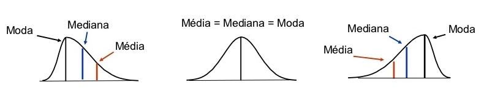
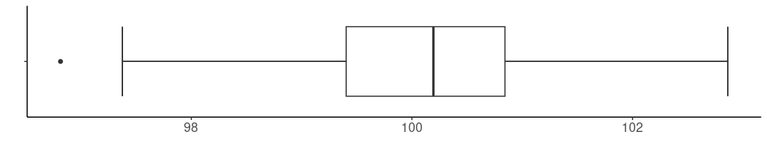
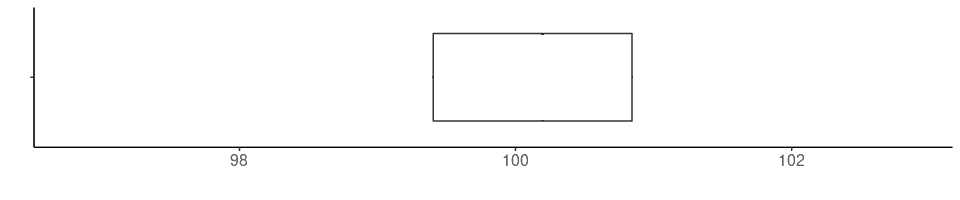
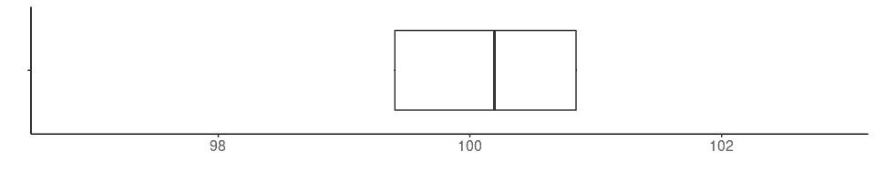

```{r, include = FALSE}
source("./config/setup.R")
library(tidyverse)
```

## Resumos numéricos

 - Uma forma de resumir a informação contida em um conjunto de dados é por meio dos \textbf{resumos numéricos}.

 - Resumos numéricos são basicamente \textbf{números que resumem números}.

 - Os dois principais grupos são as medidas de \textbf{posição} (central e relativa) e \textbf{dispersão}.

 - Existem outros conjuntos de medidas, como as medidas de \textbf{forma} e também as de \textbf{relação/associação}.

# Medidas de posição central

## Medidas de posição central

\beginAHalfColumn

 - As medidas de posição central buscam expressar o \textbf{centro} de uma variável por meio de ideias como:
   - Centro de massa.
   - Valor que divide a amostra em partes iguais.
   - Valores de maior frequência ou densidade.

\endColumns
\beginAHalfColumn

 - Algumas possiblidades são 
   - Média.
   - Mediana.
   - Moda.
   - Média geométrica.
   - Média harmônica.
   - Média aparada.

\endColumns

## Média aritmética

 - Soma de todos os valores dividida pela quantidade de elementos.
 - Interpretação física de centro de gravidade.
 - Medida influenciada por valores extremos.

\textbf{Expressão}

$$
      \overline{y} = \dfrac{\sum_{i = 1}^{n} y_i}{n} = \frac{y_1 + y_2 + \cdots + y_n}{n}.
$$


## Média aritmética

\textbf{Exemplo}

 - Considere que uma turma possui 10 alunos.
 
 - Estes alunos realizaram uma avaliação.
 
 - Considere que as notas obtidas foram:

$$60;\ 65;\ 77;\ 95;\ 56;\ 94;\ 97;\ 81;\ 80;\ 48$$

 - Qual foi a nota média da turma?


$$
\overline{y}  = \frac{60+65+77+95+56+94+97+81+80+48}{10} = \frac{753}{10} = 75,3
$$

## Média aritmética ponderada

 - Indicada para \textbf{dados agrupados} em tabelas de frequência ou situações em que existe motivo para unidades receberem um \textbf{peso} maior.
 - Obtêm-se os produtos entre frequências relativas (ou pesos) e os valores que a variável assume.
 - Somam-se os produtos e divide-se pela soma das frequências (quantidade de elementos).
 - No caso de faixas de valores, usa-se o centro da faixa.

$$
\overline{y} = \dfrac{\sum_{i = 1}^{k} f_i \cdot y_i}{\sum_{i = 1}^{k} f_i}.
$$

 - $f_i$ representa a frequência da classe $i$.
 - $k$ representa o número de classes ($k \leq n$). 

## Média aritmética ponderada

\textbf{Exemplo 1}

 - Considere que uma prova com 10 questões de múltipla escolha foi aplicada em uma turma com 100 alunos. 
 
 - Só temos acesso à uma tabela de frequências do número de questões corretas.
 
  - Qual é o número médio de questões corretas? 
  
```{r, echo=FALSE}

notas <- data.frame(Acertos = 0:10,
           Frequência = c(1, 0, 0, 5, 2, 30,
                          21, 29, 8, 3, 1))

knitr::kable(t(notas), 
             caption = "Tabela de frequências do número de questões acertadas.", 
             align ="ccc" )
```


## Média aritmética ponderada

\textbf{Exemplo 1}

$$\overline{y} = \dfrac{(0\times1)+(1\times0)+(2\times0)+(3\times5)+...+(7\times29)+(8\times8)+(9\times3)+(10\times1)}{100}$$

$$\overline{y} = \dfrac{0+0+0+15+8+150+126+203+64+27+10}{100}= 6,03$$ 

## Média aritmética ponderada

\textbf{Exemplo 2}

 - Considere a seguinte tabela de frequências da idade dos funcionários de uma empresa.

- Qual é a idade média dos funcionários?

```{r, echo=FALSE}
set.seed(1)

x <- rgamma(1000, 40)

breaks <- hist(x, plot = FALSE)$breaks

classes <- cut(x, 
               breaks = breaks, 
               include.lowest = TRUE, 
               right = TRUE)

tabela <- as.data.frame(table(classes)) 

names(tabela) <- c("Faixas", "Frequência")

knitr::kable(t(tabela), 
             caption = "Tabela de frequências das notas obtidas pelos alunos.", 
             align ="ccc" )

```


## Média aritmética ponderada

\textbf{Exemplo 2}

$$\overline{y} = \dfrac{(22,5\times3)+(27,5\times45)+(32,5\times191)...+(57,5\times7)+(62,5\times0)+(67,5\times2)}{1000}$$

$$\overline{y} = \dfrac{67,5+1237,5+6207,5+11625+...+2835+402,5+0+135
}{1000}= 39,7$$ 


## Outros tipos de média

 - Média aritmética e ponderada são os tipos de média mais comuns.
 - Contudo existem outras possibilidades como
   - Média geométrica.
   - Média harmônica.
   - Média aparada.

## Mediana

 - Valor que ocupa a \textbf{posição intermediária} dos valores ordenados.
 - Divide o vetor de valores em 2 partes de mesmo tamanho.
 - Metade dos valores é menor que a mediana e a outra metade maior que a mediana.
 - Basta ordenar o conjunto de valores e verificar qual é o valor central.
 - Se o número de observações for ímpar, a mediana é o valor central.
 - Se o número de observações for par, a mediana é a média dos dois valores centrais.

## Mediana

 - Passo 1: ordenar.
$$
y_{(1)} \leq y_{(2)} \leq \, \cdots \, \leq y_{(n-1)} \leq y_{(n)}.
$$

 - Passo 2: obter a mediana de acordo com o número de elementos.
$$
md = \begin{cases}
           y_{((n + 1)/2)}, & \text{ se } n \text{ for \'impar}.\\
           (y_{(n/2)} + y_{(n/2 + 1)})/2, & \text{ se } n \text{ for par}.\\
           \end{cases}
$$


## Mediana

\textbf{Exemplo}

 - Uma concessionária está fazendo o levantamento anual de vendas.
 
 - Considere que as vendas por mês do ano anterior estão dadas na tabela.
 
 - Qual é o número mediano de vendas?
 
```{r, echo=FALSE}
set.seed(1)
vendas <- data.frame(Mês = c("Jan",
                   "Fev",
                   "Mar",
                   "Abr",
                   "Mai",
                   "Jun",
                   "Jul",
                   "Ago",
                   "Set",
                   "Out",
                   "Nov",
                   "Dez"),
           Vendas = rpois(12, 100))

knitr::kable(t(vendas), 
             caption = "Tabela de frequências das vendas mensais.", 
             align ="ccc" )

```
 
## Mediana

\textbf{Exemplo} 

 - Passo 1: ordenar os valores.

```{r, echo=FALSE}
knitr::kable(t(arrange(vendas, Vendas) %>% 
  mutate(`(i)` = 1:12) %>% 
  select(`(i)`,Vendas)), 
             caption = "Vendas ordenadas.", 
             align ="ccc" )
```

- Passo 2: obter a mediana de acordo com o número de elementos.
  - O número de elementos é par, portanto a mediana será a média dos dois valores centrais.
  - Mediana: $(97+104)/2 = 100,5$


## Moda


\beginAHalfColumn

 - Valor ou classe que apresenta \textbf{maior frequência ou densidade}.
 - Valor mais \textbf{típico}, aquele que mais se repete.
 - Quando todos os valores são distintos, não existe moda.
 - Quando a maior frequência está associada a mais de um valor, existe mais de uma moda.

\endColumns
\beginAHalfColumn

\textbf{Exemplo}

 - Considere que os valores a seguir dizem respeito ao número de filhos por pessoa em um grupo.
 
$$2;\ 3;\ 6;\ 1;\ 3;$$ 
$$4;\ 1;\ 2;\ 0;\ 1;$$ 
$$1;\ 0;\ 1;\ 4;\ 1$$

 - Qual é a moda?
    - O valor mais frequente é $1$, que aparece 6 vezes.

\endColumns


## Média, mediana e moda

 - Na prática, estas medidas possuem vantagens e desvantagens. 
 
 - Caso haja valores discrepantes a média é uma medida altamente influenciada, o que não acontece com a moda e a mediana. 
 
 - Já a mediana é difícil de ser obtida quando existem muitos dados, dado que o processo de ordenação é custoso. 
 
 - A dificuldade com a moda surge quando trabalha-se com distribuições multimodais, isto é diversos valores tem a mesma frequência de ocorrência.

## Média, mediana e moda


 - A média tende a ser uma boa alternativa quando a distribuição é unimodal, simétrica e sem valores extremos.

 - A mediana tende a ser uma boa alternativa para distribuições assimétricas ou com presença de valores extremos.

 - A moda tende a ser uma boa alternativa quando valores se repetem, estão agrupados em classes ou trata-se de uma variável qualitativa.
 
 - Média, moda e mediana aproximam-se em distribuições unimodais simétricas.

## Média, mediana, moda e assimetria

 - Vimos anteriormente como avaliar assimetria por meio de recursos gráficos.
 
 - Podemos utilizar as medidas de posição central
    - Assimetria à direita: $moda < mediana < média$.
    - Assimetria à esquerda: $média < mediana < moda$.
    - Simetria: $média = mediana = moda$.
 
```{r, echo = FALSE, out.width='90%', fig.align='center', fig.cap="Relação medidas descritivas e assimetria"}


```

# Medidas de posição relativa

## Medidas de posição relativa

\beginAHalfColumn

 - As medidas de posição relativa ou separatrizes buscam representar \textbf{pontos do domínio} em que a variável apresenta porções com frequências conhecidas.

 - Visam encontrar valores que representam alguma parcela dos dados.

\endColumns
\beginAHalfColumn
  
 - Algumas possiblidades são 
   - Quartis.
   - Decis.
   - Percentis.
   - Máximo.
   - Mínimo.

\endColumns

## Quartis

 - Dividem a amostra em $4$ partes de mesmo tamanho.
 - A ideia para obtenção é similar à da mediana.
 - Na verdade, a mediana é um dos quartis: o segundo.
 - O primeiro e terceiro quartil são as medianas das duas partes divididas pela mediana (método de Tukey).
 
## Quartis

 - O primeiro quartil ($Q_1$) é o valor que marca $1/4$ das observações, isto é, $25\%$.
 - O segundo quartil ($Q_2$) é o valor que marca $2/4=1/2$ das observações, isto é, $50\%$ (a mediana).
 - O terceiro quartil ($Q_3$) é o valor que marca $3/4$ das observações, isto é, $75\%$.
 - A diferença entre primeiro e terceiro quartil é chamada de amplitude interquartílica ($AIQ = Q_3-Q_1$).
 - Estas quantidades são usadas para criação de um poderoso gráfico: o boxplot.

## Quartis

\textbf{Exemplo}

 - Considere os seguintes valores:
 
$$6; 12; 14;  7; 11;  7;  6; 12;  4; 11;  3;  4;  3;  4;  2$$

 - Obtenha os quartis e a amplitude interquartílica.
 
 - Passo 1: ordenar.
 
```{r, echo=FALSE}

q <- data.frame(Posição = 1:15,
           Valor = c(2, 3, 3, 4, 4, 4, 6, 6, 7, 7, 11, 11, 12, 12, 14))

knitr::kable(t(q), 
             caption = "Valores ordenados.", 
             align ="ccc")
```

## Quartis

\beginAHalfColumn

\textbf{Exemplo}

- Passo 2: obter o segundo quartil (mediana).
  - Número de elementos: $15$.
  - Posição do segundo quartil: $8$.
  - Valor do segundo quartil: $6$.

 - Passo 3: obter a mediana dos valores da primeira parcela.
    - Número de elementos: $7$.
    - Posição do segundo quartil: $3$.
    - Valor do segundo quartil: $4$.    

\endColumns
\beginAHalfColumn

 - Passo 4: obter a mediana dos valores da segunda parcela.
    - Número de elementos: $7$.
    - Posição do segundo quartil: $3$.
    - Valor do segundo quartil: $11$.

 - $Q_1 = 4$, $Q_2 = 6$, $Q_3 = 11$.  

 - Amplitude interquartílica.
 
$$AIQ = Q_3 - Q_1 = 11 - 4 = 7$$

\endColumns

## Quartis e o Box-plot

 - O box-plot faz uso dos quartis para obtenção de um gráfico. 
 - É possível analisar a distribuição dos dados: posição, variabilidade, assimetria, valores atípicos.

```{r, echo = FALSE, out.width='90%', fig.align='center', fig.cap="Ilustração box-plot completo."}


```

## Quartis e o Box-plot

 - A construção de um box-plot inicia-se com um retângulo em que a aresta inferior coincide com o primeiro quartil e a superior com o terceiro quartil.

```{r, echo = FALSE, out.width='90%', fig.align='center', fig.cap="Arestas de um box-plot."}


```

## Quartis e o Box-plot

 - A mediana é representada por um traço entre as duas arestas.

 - De $Q_1$ até $Q_3$ estão $50\%$ das observações centrais, o que dá uma ideia a respeito de quão dispersos são os valores. 

```{r, echo = FALSE, out.width='90%', fig.align='center', fig.cap="Arestas e mediana emum box-plot."}


```

## Quartis e o Box-plot

 - Para obtenção da amplitude do box-plot além do retângulo faz-se $[Q1-1,5AIQ; Q3+1,5AIQ]$. 
 
 - Desenha-se então uma linha até estes valores.

```{r, echo = FALSE, out.width='90%', fig.align='center', fig.cap="Inclusão dos limites de um box-plot."}


```

## Quartis e o Box-plot

 - Valores além destes extremos são marcados como um ponto ou asterisco e são os candidatos a valores atípicos.

```{r, echo = FALSE, out.width='90%', fig.align='center', fig.cap="Box-plot completo."}


```
  
## Outras medidas

 - Quartis são a forma mais famosa de particionamento dos dados.

 - Porém, qualquer outro percentual pode ser obtido.

 - Se temos um conjunto de n valores, organizados de forma crescente, o $P$-ésimo percentil é um número tal que $P\%$ dos valores estejam à sua esquerda e $(100 - P)\%$ à sua direita.

 - Por exemplo, se obtivermos os valores que separam a amostra em $10$ partes com frequência $1/10$, temos os decis.

 - O mínimo e o máximo também são medidas de posição relativa e fornecem informação quanto ao domínio da variável.

# Medidas de dispersão

## Medidas de dispersão

\beginAHalfColumn

 - As medidas de dispersão são utilizadas para expressar informações como o \textbf{domínio} da variável, grau de \textbf{dispersão} ao redor do centro (\textbf{variabilidade}), e também \textbf{distanciamento} dos valores com relação ao centro.

\endColumns
\beginAHalfColumn

 - Algumas medidas possíveis são
   - Amplitude.
   - Desvio absluto (médio ou mediano).
   - Variância.
   - Desvio padrão.
   - Coeficiente de variação.

\endColumns

## Medidas de dispersão

 - Em geral usamos uma medida de posição central, que nos dá uma ideia de centro dos dados.

 - Mas conjuntos de dados com diferentes valores podem gerar as mesmas medidas de posição. 

 - E mesmo com medidas de posição idêncitas, um pode ser mais disperso que o outro.
 
 - Portanto complementamos a informação a respeito do centro com uma medida de dispersão, que nos dá uma noção de quão dispersos são os dados.

 - Outra utilidade das medidas de dispersão é expressar o domínio da variável.
 
## Amplitude total

 - Diferença entre o maior e o menor valor da variável.
 - Sensível a valores extremos. 
 - Usa apenas duas medidas.

$$Amp = max(y) - min(y) = y(n) - y(1)$$

## Amplitude total

\textbf{Exemplo}

 - Retomando o problema das notas de 10 alunos, em que as notas obtidas foram:

$$60;\ 65;\ 77;\ 95;\ 56;\ 94;\ 97;\ 81;\ 80;\ 48$$

 - A amplitude é dada pelo maior menos o menor valor:
 
$$Amp = 97 - 58  = 49$$ 

## Desvio absoluto médio 

 - Um desvio absoluto médio é uma medida de distância da observação para uma medida de posição central.
 - Podemos usar como referência a média ou a mediana.
 - Tomamos todos os desvios absolutos.
 - Calculamos a média.

\beginAHalfColumn

$$
\text{desvio m\'edio} = \frac{1}{n}
      \sum_{i = 1}^n |(y_i - \overline{y})|
$$
    
\endColumns
\beginAHalfColumn

$$
\text{desvio mediano} =
      \frac{1}{n} \sum_{i = 1}^n |(y_i - md)|
$$


\endColumns

## Desvio

\textbf{Exemplo}

 - Retomando o problema das notas de 10 alunos, em que as notas obtidas foram:

$$60;\ 65;\ 77;\ 95;\ 56;\ 94;\ 97;\ 81;\ 80;\ 48$$

 - A média é $\overline{y} = 75,3$ e a mediana é $md = 78,5$.

 - Obtenha o desvio médio e mediano.

## Desvio

\textbf{Exemplo - desvio médio}

$$
\text{desvio m\'edio} = \frac{1}{10}
       \left ( |(60 - 75,3)| + |(65 - 75,3)| ... + |(80 - 75,3)| + |(48 - 75,3)| \right )
$$
$$
\text{desvio m\'edio} = \frac{1}{10}
       \left ( 15,3 + 10,3 ... + 4,7  + 27,3  \right ) = 14,44
$$


## Desvio

\textbf{Exemplo - desvio mediano}

$$
\text{desvio mediano} = \frac{1}{10}
       \left ( |(60 - 78,5)| + |(65 - 78,5)| ... + |(80 - 78,5)| + |(48 - 78,5)| \right )
$$
$$
\text{desvio mediano} = \frac{1}{10}
       \left ( 18,5 + 13,5 ... + 1,5  + 30,5  \right ) = 14,1
$$

 
## Variância e Desvio padrão

 - Em vez dos desvios, usa a soma dos quadrados dos desvios em relação à média. 

$$
s^2 = \textrm{Var}(y) = \frac{1}{n - 1} \sum_{i = 1}^{n} (y_i - \overline{y})^2 = \frac{1}{n - 1}\left(\sum_{i = 1}^{n} y_i^2 - \frac{(\sum_{i = 1}^{n} y_i)^2}{n}\right)
$$

 - Variância populacional ($\sigma^2$): usa apenas $n$ no demominador e é usada quando temos todos os elementos da população. Caso contrário, calculamos sempre a estimativa amostral ($s^2$).

 - Para ter uma medida de dispersão com a mesma unidade de medida dos dados originais definiu-se o desvio-padrão como a raiz quadrada da variância.

$$
s = \sqrt{s^2}
$$
  
## Regra empírica variância e desvio padrão

Quando a distribuição dos dados é simétrica sabemos que:

 - Aproximadamente $68\%$ das observações estão entre mais ou menos um desvio padrão.

 - Aproximadamente $95\%$ das observações estão entre mais ou menos dois desvios padrões.

 - Aproximadamente $100\%$ das observações estão entre mais ou menos três desvios padrões.

## Variância e desvio padrão

\textbf{Exemplo}

 - Retomando o problema das notas de 10 alunos, em que as notas obtidas foram:

$$60;\ 65;\ 77;\ 95;\ 56;\ 94;\ 97;\ 81;\ 80;\ 48$$

 - A média é $\overline{y} = 75,3$.

 - Obtenha o variância e desvio padrão.

## Variância e desvio padrão

\textbf{Exemplo}

 - Primeira maneira:
 
$$
s^2 = \textrm{Var}(y) = \frac{1}{10 - 1} \left ( (60 - 75,3)^2 + (65 - 75,3)^2 + ... + (80 - 75,3)^2 + (48 - 75,3)^2   \right )
$$

$$
s^2 = \textrm{Var}(y) = \frac{1}{9} \left ( (-15,3)^2 + (-10,3)^2 + ... + (4,7)^2 + (-27,3)^2   \right )
$$

$$
s^2 = \textrm{Var}(y) = \frac{1}{9} \left ( 234,09 + 106,09 + ... + 22,09 + 745,29 \right ) = 302,68
$$

$$ s = \sqrt{s^2} = \sqrt{302,68} = 17,4$$

## Variância e desvio padrão

\textbf{Exemplo}

 - Segunda maneira:
 
$$
s^2 = \textrm{Var}(y) = \frac{1}{n - 1}\left(\sum_{i = 1}^{n} y_i^2 - \frac{(\sum_{i = 1}^{n} y_i)^2}{n}\right)
$$

$$
s^2 = \textrm{Var}(y) = \frac{1}{9}\left(59425
 - \frac{753^2}{10}\right) = \frac{1}{9}\left(59425
 - 56700.9\right) = 302,68
$$

$$ s = \sqrt{s^2} = \sqrt{302,68} = 17,4$$


## Coeficiente de variação

 - Medida de variabilidade relativa à média.
 - Quociente do desvio-padrão pela média.
 - Medida adimensional, geralmente apresentada na forma de porcentagem.
 - Permite comparar a variabilidade de variáveis de diferentes naturezas

$$
\textrm{CV} = 100 \cdot \frac{s}{\overline{y}}
$$

## Coeficiente de variação

\textbf{Exemplo}

 - Retomando o problema das notas de 10 alunos, em que as notas obtidas foram:

$$60;\ 65;\ 77;\ 95;\ 56;\ 94;\ 97;\ 81;\ 80;\ 48$$

 - A média é $\overline{y} = 75,3$ e o desvio padrão é $s = 17,4$.

 - Obtenha o coeficiente de variação.
 
$$
\textrm{CV} = 100 \cdot \frac{17,4}{75,3} = 23,11
$$


## Desvio, variância, desvio padrão, coeficiente de variação


 - A amplitude é simples de calcular, mas é influenciada por valores extremos.

 - Os desvios absolutos (médio ou mediano) são menos influenciados por valores extremos.
 
 - Variância e desvio padrão são influenciados por valores extremos mas tem propriedades favoráveis.
 
 - O coeficiente de variação permite comparar a variabilidade de variáveis em diferentes escalas.

 - Para variáveis qualitativas existem medidas que avaliam a dispersão são funções das frequências das classes, como a entropia.

## 

\beginAHalfColumn

\textbf{O que foi visto:}

 - Resumos numéricos.
 - Medidas de posição central.
 - Medidas de posição relativa.
 - Medidas de dispersão.

\endColumns
\beginAHalfColumn

\textbf{Próximos assuntos:}

 - Análises bivariadas.
    - Qualitativa x qualitativa.
    - Quantitativa x quantitativa.
    - Quantitativa x qualitativa.

\endColumns


